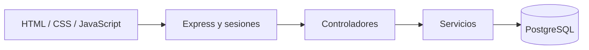

# Librería Magna · Biblioteca personal


Una biblioteca personal para organizar libros, registrar el progreso de lectura y administrar usuarios. Interfaz de inspiración clásica con tema oscuro; backend separado en rutas, controladores y servicios.

## Funcionalidades

- Registro e inicio de sesión; contraseñas con bcrypt.
- Catálogo personal con libros, autores, géneros, notas y valoración.
- Estados de lectura: por leer, leyendo, leído y abandonado.
- Perfil de usuario y panel de administración.
- Google OAuth opcional; el acceso tradicional funciona sin configurar Google.

## Arquitectura



## Instalación

Requisitos: **Node.js 22**, npm y PostgreSQL. El nombre interno de la base `libreria_pablito` se conserva para compatibilidad con la versión académica.

```powershell
cd backend
npm ci
Copy-Item .env.example .env
```

Edita `.env`: configura la conexión y reemplaza `SESSION_SECRET` por un valor aleatorio de al menos 32 caracteres. Puedes generar uno con `node -e "console.log(require('crypto').randomBytes(32).toString('hex'))"`.

```powershell
createdb -U postgres libreria_pablito
psql -U postgres -d libreria_pablito -f database/database.sql
npm run seed
npm start
```

Abre **http://localhost:3000**. Para crear el administrador, configura `SEED_ADMIN_EMAIL` y `SEED_ADMIN_PASSWORD` (al menos 12 caracteres) en tu `.env` antes de `npm run seed`. El script no muestra la contraseña ni modifica cuentas existentes. Los lectores pueden registrarse desde la interfaz; no hay contraseñas predeterminadas.

Para Google, configura `GOOGLE_CLIENT_ID`, `GOOGLE_CLIENT_SECRET` y el callback `http://localhost:3000/api/auth/google/callback` en tu consola de Google.

## Verificaciones

```powershell
cd backend
npm test
```

Pruebas HTTP de salud, páginas y recursos estáticos, autenticación requerida, validación de registro y ausencia de CORS abierto. No requieren PostgreSQL; los flujos completos de registro, login y CRUD necesitan una base configurada.

## Estructura

| Ruta | Responsabilidad |
| --- | --- |
| `backend/routes` | Endpoints y autorización |
| `backend/controllers` | Peticiones y respuestas |
| `backend/services` | Operaciones de negocio |
| `backend/config` | PostgreSQL y Passport |
| `backend/database` | Esquema y datos demo |
| `frontend` | Páginas, estilos y recursos visuales |

## Alcance

Proyecto académico para demostración local. Usa el almacenamiento de sesiones en memoria de Express; un despliegue real requiere un almacén persistente, HTTPS, protección CSRF y límites de intentos de acceso. Las imágenes conservan los recursos originales del proyecto; revisa su procedencia antes de una explotación comercial.

Autor del repositorio: [Sokir1](https://github.com/Sokir1).
